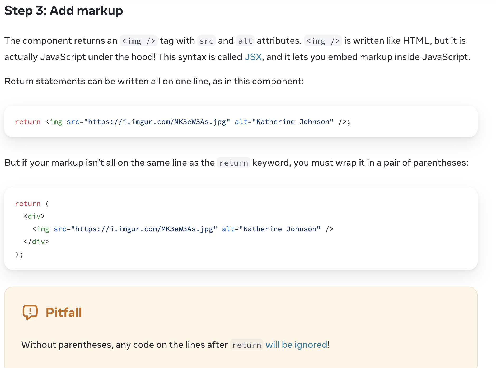
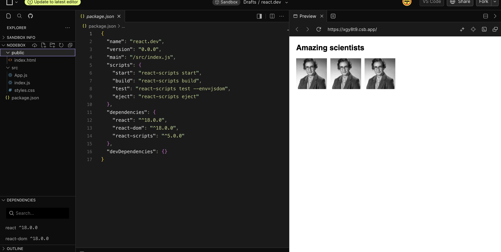
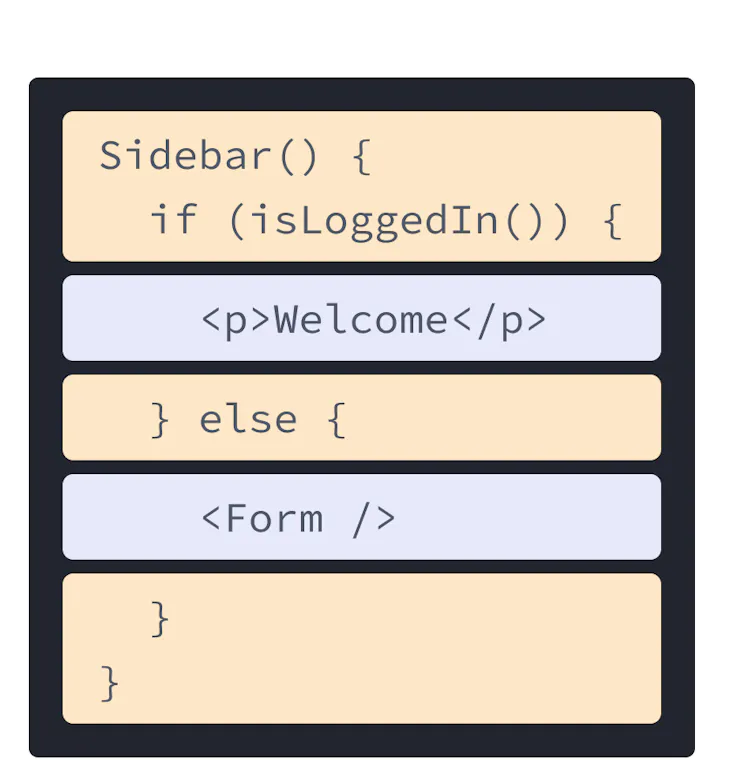
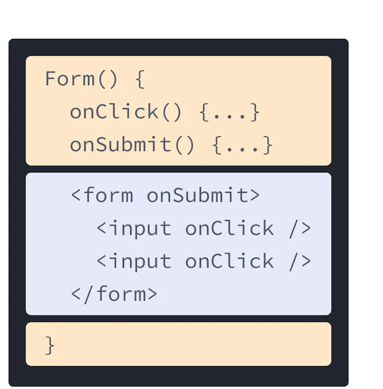
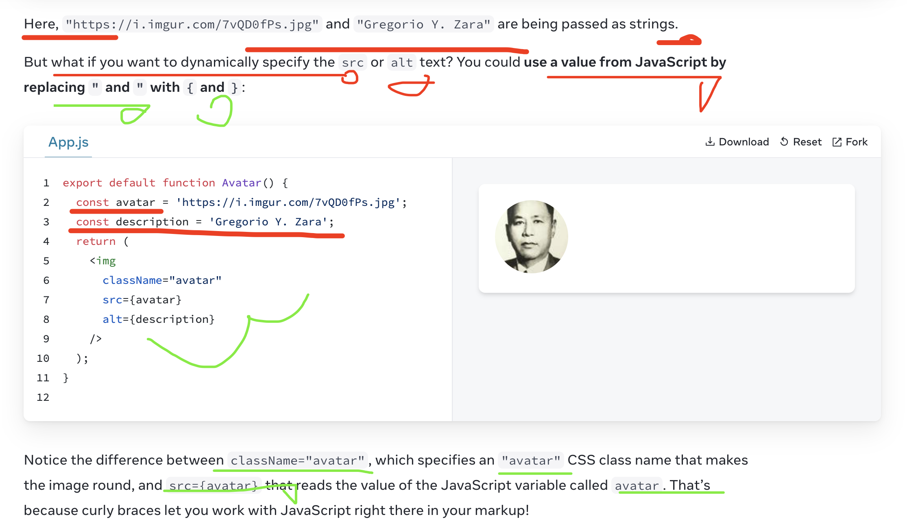
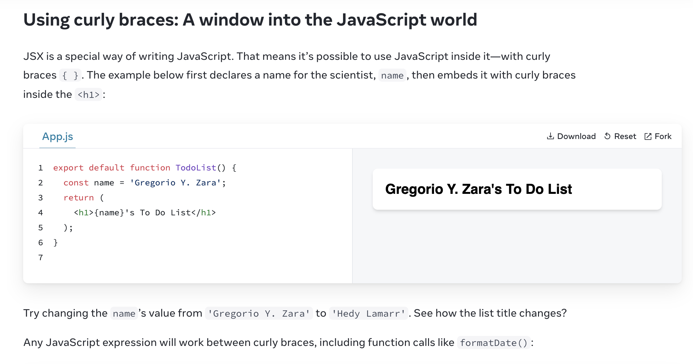

# Your First Component
https://react.dev/learn/your-first-component

1:Chakra UI
https://v2.chakra-ui.com/
2: Material UI
https://mui.com/material-ui/

The export default prefix is a standard JavaScript syntax (not specific to React). It lets you mark the main function in a file so that you can later import it from other files. (More on importing in Importing and Exporting Components!)
The export default prefix is a standard JavaScript syntax (not specific to React). It lets you mark the main function in a file so that you can later import it from other files. (More on importing in Importing and Exporting Components!)

React components are regular JavaScript functions, but their names must start with a capital letter or they won’t work!
React components are regular JavaScript functions, but their names must start with a capital letter or they won't work!

Return statements can be written all on one line, as in this component:
Return statements can be written all on one line , as in this component:
return ;

But if your markup isn’t all on the same line as the return keyword, you must wrap it in a pair of parentheses:
return (
  

    
  

);

But if your markup isn't all on the same line as the return keyword, you must wrap it in a pair of parentheses:

Without parentheses, any code on the lines after return will be ignored!
Without parentheses, any code on the lines after return will be ignored!
## the simplest app (component) of React

##
Still, many websites only use React to add interactivity to existing HTML pages. They have many root components instead of a single one for the entire page. You can use as much—or as little—React as you need.
Still, many websites only use React to add interactivity to existing HTML pages. They have many root components instead of a single one for the entire page. You can use as much-or as little-React as you need.

React-based frameworks take this a step further. Instead of using an empty HTML file and letting React “take over” managing the page with JavaScript, they also generate the HTML automatically from your React components. This allows your app to show some content before the JavaScript code loads.

//React-based frameworks take this a step further. Instead of using an empty HTML file and letting React "take over " managing the page with JavaScript, they also generate the HTML automatically from your React components. This allows your app to show some content before the JavaScript code loads.
## Importing and Exporting Components
https://react.dev/learn/importing-and-exporting-components

The magic of components lies in their reusability: you can create components that are composed of other components. But as you nest more and more components, it often makes sense to start splitting them into different files. This lets you keep your files easy to scan and reuse components in more places.
## Writing Markup with JSX
https://react.dev/learn/writing-markup-with-jsx

JSX is a syntax extension for JavaScript that lets you write HTML-like markup inside a JavaScript file. Although there are other ways to write components, most React developers prefer the conciseness of JSX, and most codebases use it.

JSX is a syntax extension for JavaScript that lets you write HTML-like marup inside a JavaScript file. Although there are other ways to write components, most React developers perfer the conciseness of JSX, and most codebases use it.

The Web has been built on HTML, CSS, and JavaScript. For many years, web developers kept content in HTML, design in CSS, and logic in JavaScript—often in separate files! Content was marked up inside HTML while the page’s logic lived separately in JavaScript:
//
The Web has been built on HTML, CSS , and JavaScript. For many years, web developers kept content in HTML, design in CSS, and logic in JavaScript -often in separate files! Content was marked up inside HTML while the page's logic lived separately in JavaScript:

But as the Web became more interactive, logic increasingly determined content. JavaScript was in charge of the HTML! This is why in React, rendering logic and markup live together in the same place—components.

But as the Web became more interactive, logic increasingly determined content. JavScript was in charge of the HTML! This is why in React, rendering logic and markup live together in the same place-components.

 
 

Each React component is a JavaScript function that may contain some markup that React renders into the browser. React components use a syntax extension called JSX to represent that markup. JSX looks a lot like HTML, but it is a bit stricter and can display dynamic information. The best way to understand this is to convert some HTML markup to JSX markup.

Note :JSX and React are two separate things. They’re often used together, but you can use them independently of each other. JSX is a syntax extension, while React is a JavaScript library.
JSx and React are two separate things. They're often used together, but you can use them independntly each other.
JSX is a syntax extension, while React is a JavaScript library.

This is because JSX is stricter and has a few more rules than HTML! If you read the error messages above, they'll guide you to fix the markup, or you can follow the guide below.
Most of the time, React’s on-screen error messages will help you find where the problem is. Give them a read if you get stuck!

Most of the time , React's on-screen error messages will help you find where the problem is. Give them a read if you get stuck!

## The Rules of JSX 
1. Return a single root element 
To return multiple elements from a component, wrap them with a single parent tag.

For example, you can use a 
:
1: Return a single root element
To return multiple elements from a component, wrap them with a single parent tag.

Fragments are useful because grouping elements with a Fragment has no effect on layout or styles, unlike if you wrapped the elements in another container like a DOM element. If you inspect this example with the browser tools, you’ll see that all <h1> and <article> DOM nodes appear as siblings without wrappers around them:

//

Fragments are useful because grouping elements with a Fragment has no effect on layout or styles, unlike if you wrapped the elements in another container like a DOM element. If you inspect this example with the browser tools, you'll see that all <h1> and <article> DOM nodes appear as siblings without wrappers around them:

Assigning multiple elements to a variable 
Like any other element, you can assign Fragment elements to variables, pass them as props, and so on:

Assigning multiple elements to a variable 
Like any other element, you can assign Fragment elements to variables, pass them as props, and so on:

Here’s a situation where you need to write Fragment explicitly instead of using the <></> syntax. When you render multiple elements in a loop, you need to assign a key to each element. If the elements within the loop are Fragments, you need to use the normal JSX element syntax in order to provide the key attribute:

Here's a situation where you need to write Fragment explicitly instead of using the <> </> syntax. When you render multiple 
elements in a loop, you need to assign a key to each element. If the elements within the loop are Fragments, you need to use the normal JSX element syntax in order to provide the key attribute:

## 2. Close all the tags 
JSX requires tags to be explicitly closed: self-closing tags like  must become , and wrapping tags like <li>oranges must be written as <li>oranges</li>.

This is how Hedy Lamarr’s image and list items look closed:

JSX requires tags to be explicitly closed : self-closing tags like  must become , and wrapping tags like <li>
oranges must be written as <li> oranges </li>

 camelCase all most of the things! 

JSX turns into JavaScript and attributes written in JSX become keys of JavaScript objects. In your own components, you will often want to read those attributes into variables. But JavaScript has limitations on variable names. For example, their names can’t contain dashes or be reserved words like class.

This is why, in React, many HTML and SVG attributes are written in camelCase. For example, instead of stroke-width you use strokeWidth. Since class is a reserved word, in React you write className instead, named after the corresponding DOM property:

## Pro-tip: Use a JSX Converter 
Converting all these attributes in existing markup can be tedious! We recommend using a converter to translate your existing HTML and SVG to JSX. Converters are very useful in practice, but it’s still worth understanding what is going on so that you can comfortably write JSX on your own.

Here is your final result:
convert HTML to JSX 
https://transform.tools/html-to-jsx

## JavaScript in JSX with Curly Braces

JSX lets you write HTML-like markup inside a JavaScript file, keeping rendering logic and content in the same place.
Sometimes you will want to add a little JavaScript logic or reference a dynamic property inside that markup. In this situation, you can use curly braces in your JSX to open a window to JavaScript.

Notice the difference between className="avatar", which specifies an "avatar" CSS class name that makes the image round, and src={avatar} that reads the value of the JavaScript variable called avatar. That’s because curly braces let you work with JavaScript right there in your markup!

Notice the difference between className="avatar", which specifies an "avatar" CSS class name that makes the image round, and src={avatar} that reads the value of the JavaScript variable called avatar. That's because curly braces let you work with JavazScript right there in your markup!

